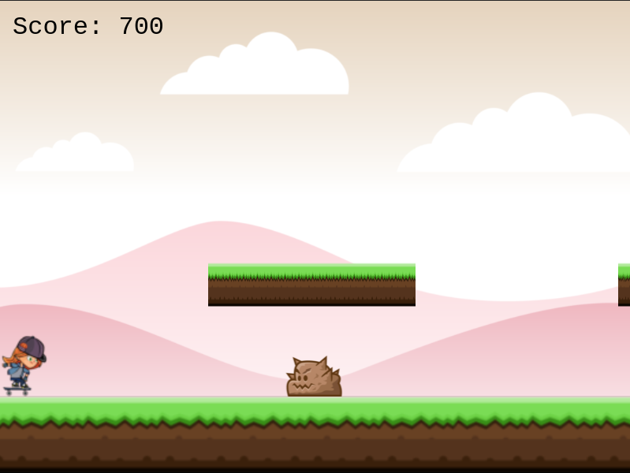

# Skeight
## Game Developed using Phaser 3, Webpack, and ES6.

Implementation of an Endless game built with [Phaser 3](https://phaser.io/phaser3) framework.

On this project, I've built an easy-play platform game where your player, a rebel skate girl, has to avoid the police and the obstacles while collecting beers to gain points. There are some standard tricks you can do while combining arrow keyboards.
Local storage was used to store the username, and Leaderboard API is used to track the highest scores.

### How to Play

You can move the player using LEFT or RIGHT arrow keys and use the UP arrow key for jumping.

## Built With

- HTML5/CSS
- Phaser 3
- Webpack
- Javascript
- Eslint
- [Netlify](https://www.netlify.com/) for deployment
- [Leaderboard API service](https://www.notion.so/Leaderboard-API-service-24c0c3c116974ac49488d4eb0267ade3) for Highscores

## Live Demo

[Play Game on Live Link](https://skeight-phaser3.netlify.app/)

## Run the project on your local environment

1. Navigate to the directory where you wanna clone the repo.
2. Clone this project with `git clone https://github.com/epinczinger/phaser3-game.git` on the command line.
3. Type `cd phaser3-game` to enter the project folder.

4. From the cloned project's directory, run `yarn install`.

Once you've installed the project's dependencies, you can run the project using [Webpack Dev Server](https://github.com/webpack/webpack-dev-server).

5. From your project's directory, run `yarn run webpack-dev-server`.

6. Open up your browser to `http://localhost:8080`.

7. You should see a web page with the game interface requesting for player name. That's the game!
8. Enjoy it!

## Future Implementation

Double Jump.
Some Skate Tricks.
Increase speed during time, so difficulty get high while you play.

## Author 

👤 **Esteban Pinczinger** 
    
- Github: [epinczinger](https://github.com/epinczinger)
- Linkedin: [Esteban-Pinczinger](https://www.linkedin.com/in/esteban-pinczinger/)
- E-mail: epinczinger@gmail.com

## 🤝 Contributing

Contributions, issues and feature requests are welcome!

Feel free to check the [issues page](https://github.com/epinczinger/phaser3-game/issues).

## Show your support

Give a ⭐️ if you like this project!

## Acknowledgments

- My standup team
- My Javascript partner [Joseph-Burke](https://github.com/Joseph-Burke)
- [Microverse](https://www.microverse.org/)
- [Phaser](https://phaser.io/)
- [OpenGameArt](https://opengameart.org/)
- [Code Academy](https://www.codecademy.com/learn/learn-phaser)